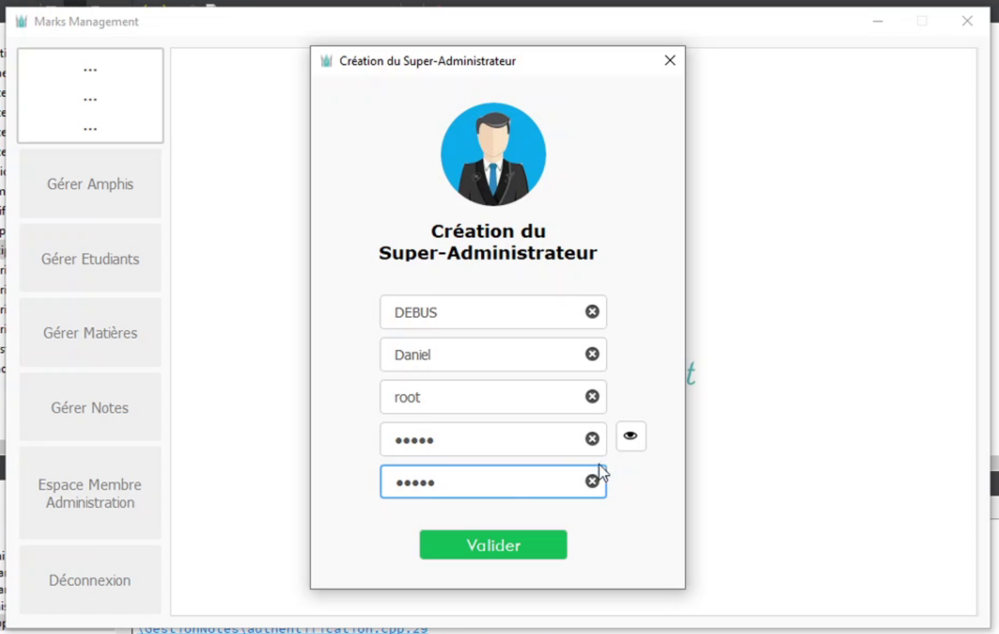
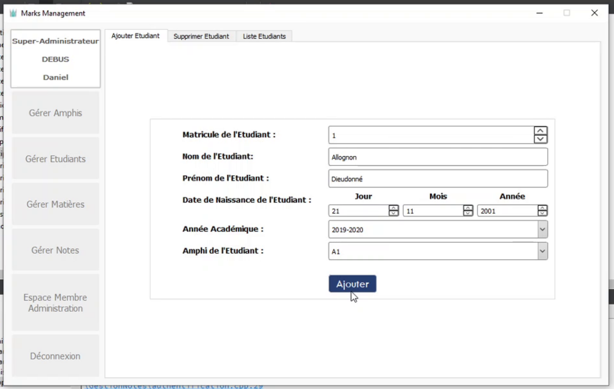

# Marks Management

MarksManagement est une application de gestion des notes d'examen des étudiants dans les centres d'enseignemets.
Créé à la base pour une utilisation par les entités universitaires, il est tout
autant exploitables dans les centres d'enseignements où une note final est
attribué apprenants.

## Utilisation

Compiler le projet dans Qt pour obtenir l'exécutable GestionNotes.exe ( en cas de possession de l'exécutable)
Lancer GestionNotes.exe en tant qu'administrateur.
L'exécution de l'application nécessite une base de donnée, le fichier "gestionNotes.sdb" qui est
créé automatiquement dans le répertoire de compilation du projet.

A la première utilisation, un enregistrement sera nécessaire au premier l'utilisateur de l'application qui sera enregistré comme le Super-Administrateur,
qui aura tout les privilèges pour effectuer toutes les manipulations permises par l'application.
Lorsque vous transférez le programme vers un autre ordinateur, vous pouvez copiez le fichier de base de donnée vers le nouvel ordinateur afin de conserver
vos données, sans quoi vous devez à nouveau vous enregistrer si l'application ne
retrouve pas la base de donnée ou qu'aucun Super-Administrateur n'existe encore
dans la base de donnée retrouvée.

Voir [Manuel
d'utilisation](https://github.com/dieudonneallognon/marksManagement/blob/main/Manuel%20Dutilisation.pdf).

## Fonctionnement

* Super-Administrateur: Celui qui gère toute l' application et qui peut déléguer en ajoutant des utilisateurs secondaires (Membres de l'Administration).

* Membres de l'Administration: Délégué par le Super-Administrateur, peut gérer sa partie de l'application en fonction des autorisations.

## Fonctionnalités

* Possibilité d'ajouter les amphis, les étudiants pour une année académique, les matières, les membres de l'administration ( si Super-Administrateur )

* Possibilité de supprimer les amphis, les étudiants, les matières, les membres de l'administration ( si Super-Administrateur )

* Possibilité de consulter et de modifier les notes des étudiants ( si Super-Administrateur )

* Possibilité de consulter la liste des utilisateurs et son profil et modifier son mot de passe ( si Super-Administrateur )

* Possibilité d'ajouter les amphis, les étudiants pour une année académique, les matières ( si Membre de l'Administration )

* Possibilité de supprimer les amphis, les étudiants, les matières ( si Membre de l'Administration )

* Possibilité de consulter et de modifier les notes des étudiants ( si Membre de l'Administration )

* Possibilité de consulter la liste des utilisateurs et son profil et modifier
  son mot de passe ( si Membre de l'Administration )
